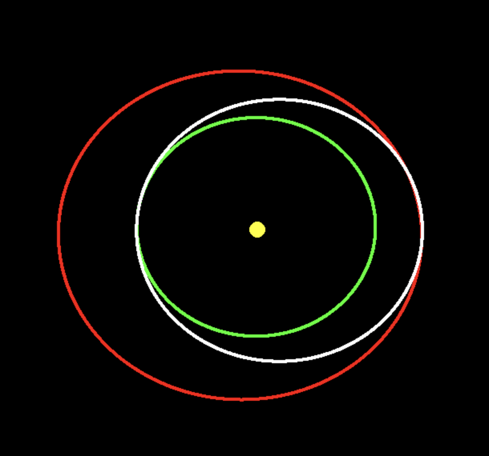
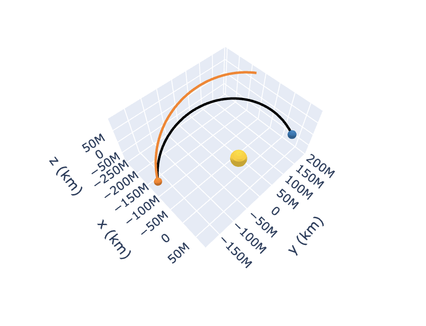

# Hohmann & Lambert Maneuver Simulator

Simple orbital mechanics simulator that calculates and visualizes Hohmann transfers and Lambert maneuvers. 

## Pygame Simulation

## Lambert Maneuver

## Features
- **Hohmann Transfer Simulation**: 
  - Built with Pygame for visualization.
  - Real ephemeris data from NASA's SPICE DE421 BSP files via Skyfield.
  - Calculate $\Delta v_1$, the initial velocity change required to transition from the starting orbit to the Hohmann transfer ellipse.
$$\Delta v_1 = \sqrt{\frac{\mu}{r_1}} \left(\sqrt{\frac{2r_2}{r_1+r_2}}-1\right)$$

- **Lambert Maneuver Calculation**: 
  - Uses Poliastro to solve the Lambert boundary-value problem, determining the velocity vectors for a trajectory between two specified positions in space over a given transfer time.

## How It Works
- **Hohmann Transfers**: Uses SPICE data (via Skyfield) to position planets accurately, with their velocities in 3d space, then calculates $`\Delta v_1`$ to shift to Hohmann ellipse.
- **Lambert Maneuvers**: Employs Poliastro to solve the boundary-value problem, determining the velocity vectors needed to travel between two positions in space over a given time.

## Dependencies
- **Pygame**: For visualizing the Hohmann transfer simulation.
- **Skyfield**: To load and process SPICE DE421 BSP ephemeris data.
- **Poliastro**: For Lambert maneuver computations.
